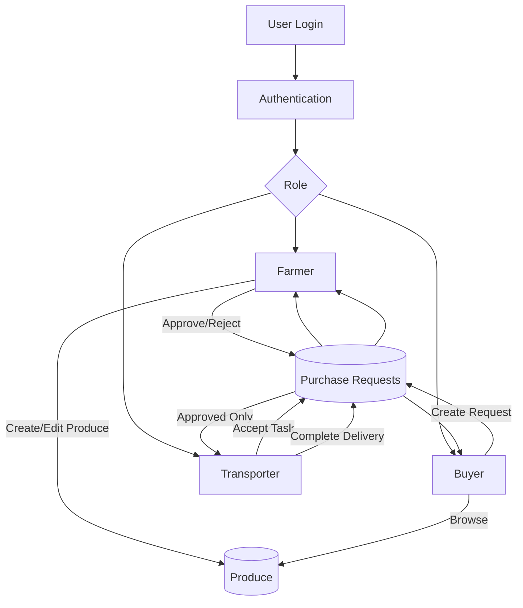

# FarmConnect


## **1. Vision**
FarmConnect is a lightweight web application that helps farmers list available produce, buyers place purchase requests, and transporters manage delivery tasks. It replaces scattered phone calls and manual coordination with a clean, structured workflow. This is a success if a user can list produce, a buyer can request it, and a transporter can complete the delivery.

## **2. Users**
### 1. Farmer
- manages a small farm and wants a simple way to list his produce and receive purchase requests.
- Needs: list produce, track buyer requests, confirm availability

### 2. Buyer
- purchases produce for a local market. She wants a clear list of available items and a simple way to place orders.
- Needs: browse produce, request purchase, track order status

### 3. Transporter
- handles deliveries between farms and buyers. He needs a clean dashboard showing assigned delivery tasks.
- Needs: see delivery tasks, mark tasks completed

## **3. User stories**

- As a **farmer**, I want to **create an account**, so that **I can list my produce**.
**Done when:** signup works, login works, farmer dashboard loads.

- As a **farmer**, I want to **list produce items**, so that **buyers can see what’s available**.
**Done when:** form saves item name, quantity, price, and appears in the list.

- As a **buyer**, I want to **browse available produce**, so that **I can find items to purchase**.
**Done when:** buyer sees list of all produce with name, quantity, price.

- As a **buyer**, I want to **request a purchase**, so that the farmer knows I want their produce.
**Done when:** buyer submits request, farmer sees it, request shows “Pending”.

- As a **farmer**, I want to **approve or reject a purchase request**, so that **buyers know the status**.
**Done when:** farmer clicks approve/reject, status updates for buyer.

- As a **transporter**, I want to **see all approved purchase requests**, so that **I know what needs delivery**.
**Done when:** transporter dashboard shows approved tasks with farm + buyer info.

- As a **transporter**, I want to **accept a delivery task**, so that **I can take responsibility for it**.
**Done when:** transporter clicks “Accept”, task assigns to them.

- As a **transporter**, I want to **mark a delivery as completed**, so that **the buyer and farmer know it’s done**.
**Done when:** status updates to “Completed” and appears in history.

- As a **farmer**, I want to **edit or delete a produce listing**, so that **I can keep information accurate**.
**Done when:** product listing table gets updated.

- As a **buyer**, I want to **see the status of my purchase requests**, so that **I know what’s happening**.
**Done when:** Can see the status of the purchase requests as pending, approved, transporter assign etc.

- As a **buyer**, I want to **rate the purchase**, so that **it helps to ensure quality of produce**.
**Done when:** Ratings updated, other users can see the ratings.

- As a **transporter**, I want to **filter tasks by location**, so that **I can manage my workload**.
**Done when:** Location filter is available, location filtering is applied.

- As a **buyer**, I want to **message the farmer**, so that **I can clarify details**.
**Done when:** chat channel is available, farmer message reaches buyer and vice versa.

- As a **transporter**, I want to **a map link to farm and buyer locations**, so that **transporter can see the travel details**.
**Done when:** can see source and destinations, travel details like distance, time etc.

- As a **farmer**, I want to **upload a photo of produce**, so that **buyers can understand the quality of produce**.
**Done when:** farmers upload photos, buyers can see the photos.


## **4. Scope**

### **Must-Have (MVP)**
Farmer signup/login

Farmer produce listing

Buyer browsing + purchase requests

Farmer approval/rejection

Transporter dashboard

Accept + complete delivery tasks

Status updates visible to all roles

### **Nice-to-Have**
Photos

Map links

Messaging

Manager dashboard

Ratings

Task History

Payment System

### **Non-Goals**
No GPS tracking

No inventory management

No automated routing

No analytics or charts

No marketplace bidding system


## **5. Key screens / mockups.**
### 1. Farmer Dashboard
Button: “Add Produce”

List of produce items

Incoming buyer requests

Approve/Reject buttons

### 2. Add Produce Form
Name

Quantity

Price

Description

Submit

### 3. Buyer Dashboard
List of all produce

“Request Purchase” button

Status of past requests

### 4. Transporter Dashboard
List of approved requests

Farm → Buyer delivery info

“Accept Task” button

“Complete Delivery” button


## **6. Data & rules.**
### Core Data Models
#### User
id

name

email

passwordHash

role (farmer / buyer / transporter)

#### Produce
id

farmerId

name

quantity

price

description

createdAt

#### PurchaseRequest
id

buyerId

produceId

status (pending / approved / rejected / delivering / completed)

assignedTransporterId (nullable)

createdAt

### Rules
Farmers can only edit their own produce.

Buyers can only request existing produce.

Transporters can only complete tasks assigned to them.

A request must be approved before transporters see it.

Only one transporter can accept a task.

---

## About the implementation

The app allows farmers to list available produce, including basic details such as name, quantity, and price. This gives farmers a clear, organized way to present what they have for sale. Buyers can browse all available produce, request purchases, track the status of their requests, message farmers, and rate their experience. Transporters see approved requests as delivery tasks, accept them, and mark them completed. All of it is backed by a Flask API and a MySQL database, with a React + Vite frontend.

### Tech stack

- **Frontend:** React 18, Vite, Tailwind CSS, React Router, Axios (`frontend/`)
- **Backend:** Flask, PyMySQL (`backend/app.py`)
- **Database:** MySQL (`backend/schema.sql` creates DB + tables + demo data)

### How to run

```bash
# 1. Database — paste backend/schema.sql into MySQL Workbench and run it
# 2. Backend (port 5000)
cd backend
pip install -r requirements.txt
python app.py

# 3. Frontend (port 5173)
cd ../frontend
npm install
npm run dev
```

Open http://localhost:5173 and log in with any demo account
(`farmer@farmconnect.com`, `buyer@farmconnect.com`, `transporter@farmconnect.com`, password `password`).

See `QUICK_START.md` and `SETUP.md` for full details.

---


## Flowchart


